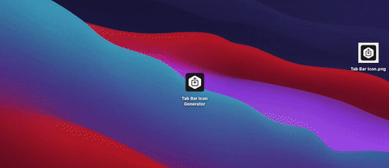

  
 
  
  
  

# TabBarIconGenerator
macOS application that generates custom tab bar icon imageset from a given image.

## Installation
To install Tab Bar Icon Generator go to [releases](https://github.com/IrelDev/TabBarIconGenerator/releases) page and download the `Tab Bar Icon Generator.app` you need. If you prefer to build the project yourself just clone the `master` branch.

## Demo

  
 

## Reason
Developers who have ever tried to create icons for their app have found that the size of icons must be different for different categories of devices. To create icons of various sizes, developers usually use apps like AppIconBuilder, but these apps don't have any support for creating tab bar icons that also need to be resized, so I created a small app that solves this problem and allows you to create `.imageset` folder containing resized images and `Contents.json` file.

## License
TabBarIconGenerator is available under the MIT license, see the [LICENSE](LICENSE) file for more information.
